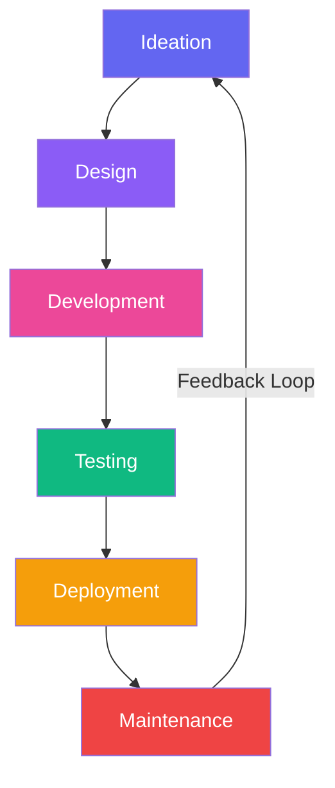

👋 Hello, I'm Ivan Makarevich!

<div align="center">

https://github.com/netron21/netron21/blob/main/assets/github-header.png?raw=true

https://readme-typing-svg.demolab.com?font=Fira+Code&size=28&duration=4000&pause=1000&color=6366F1&center=true&vCenter=true&width=550&height=50&lines=Frontend+Developer;React+Specialist;Next.js+Enthusiast;Creative+Problem+Solver

</div>

🚀 About Me

```javascript
const ivan = {
  pronouns: "He" | "Him",
  code: ["JavaScript", "TypeScript", "HTML", "CSS"],
  frameworks: ["React", "Next.js", "Tailwind CSS", "Sass"],
  tools: ["Docker", "Git", "Figma", "Photoshop"],
  architecture: ["Microservices", "SPA", "Responsive Design"],
  passion: "Creating beautiful and functional web experiences",
  funFact: "I believe every line of code tells a story"
};
```

🛠️ Tech Stack

🎨 Frontend Development

<p>
  
  
  
  
  
  
  
  
</p>

⚙️ Backend & DevOps

<p>
  
  
</p>

🛠️ Tools & Platforms

<p>
  
  
  
  
  
  
</p>

📊 GitHub Analytics

<div align="center">

https://github-readme-stats.vercel.app/api?username=netron21&show_icons=true&theme=radical&hide_border=true&bg_color=00000000 https://github-readme-stats.vercel.app/api/top-langs/?username=netron21&layout=compact&theme=radical&hide_border=true&bg_color=00000000

https://streak-stats.demolab.com?user=netron21&theme=radical&hide_border=true&background=00000000

</div>

🌱 Learning Journey

Category Skills
🚀 Mastering Next.js, Advanced React Patterns, TypeScript
📚 Learning Docker, Backend Integration, Performance Optimization
 GraphQL, Testing Strategies, CI/CD Pipelines
🎯 Future Goals Cloud Technologies, Mobile Development, AI/ML Basics

📈 My Coding Activity



🏆 Achievements

https://github-profile-trophy.vercel.app/?username=netron21&theme=radical&no-frame=true&row=2&column=4

📫 Let's Connect!

<div align="center">

https://img.shields.io/badge/Telegram-26A5E4?style=for-the-badge&logo=telegram&logoColor=white&link=https://t.me/netron21 https://img.shields.io/badge/WhatsApp-25D366?style=for-the-badge&logo=whatsapp&logoColor=white&link=https://wa.me/375292173260 https://img.shields.io/badge/Instagram-E4405F?style=for-the-badge&logo=instagram&logoColor=white&link=https://instagram.com/vanyamak2005/ https://img.shields.io/badge/VKontakte-0077FF?style=for-the-badge&logo=vk&logoColor=white&link=https://vk.com/ivaskajr https://img.shields.io/badge/Email-D14836?style=for-the-badge&logo=gmail&logoColor=white&link=mailto:your-email@example.com

</div>

💡 Philosophy

"The web is my canvas, and code is my paintbrush. I create experiences that not only function flawlessly but also inspire and delight users."

---

<div align="center">

⚡ Daily Motivation

https://quotes-github-readme.vercel.app/api?type=horizontal&theme=radical

Thanks for visiting! Let's build something amazing together! 🚀

https://komarev.com/ghpvc/?username=netron21&color=6366F1&style=for-the-badge&label=VISITORS

https://github.com/netron21/netron21/blob/main/assets/github-footer.png?raw=true

</div>